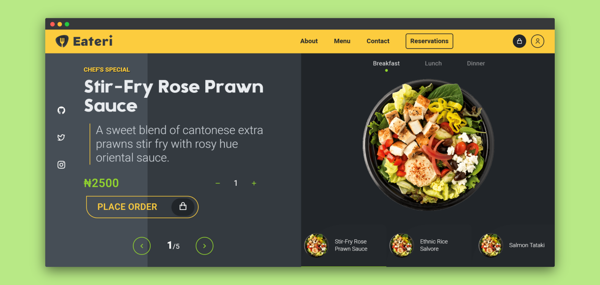
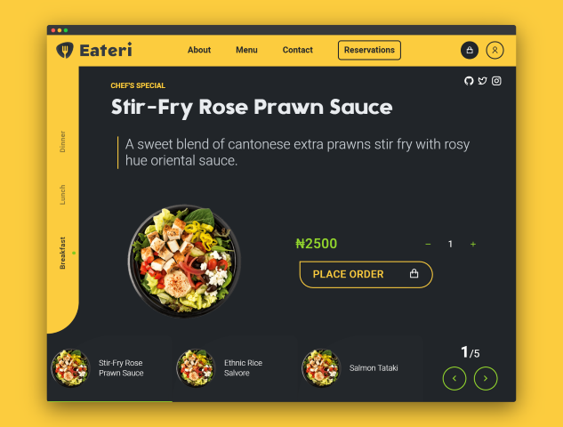

    

    

<h2 align="center" >The Messi of Great Food</h2>
<h4 align="center">
👩‍🍳 🥘 Restaurant App and CMS 🍷 🍽
</h4>

[![Badge][strapibadge]](https://strapi.io/)&nbsp;&nbsp;[![Badge][lovebadge]](https://img.shields.io)&nbsp;&nbsp;[![Badge][gqlbadge]](https://graphql.org/)&nbsp;&nbsp;[![Badge][nextjsbadge]](https://nextjs.org)

  

---

Do you need a touch of inspiration to build a mobile web app to manage restaurants or any food business? Well, look no further! **Eateri** is a concept app designed and built to help you deliver a modern looking food app to prospective clients.

## Tech Stack 🧰

-   [Next.js](https://github.com/zeit/next.js) - SSR
-   [Emotion](https://github.com/emotion-js/emotion) - Styling UI
-   [Theme-ui](https://github.com/system-ui/theme-ui) - Themeable UI
-   [React-spring](https://github.com/react-spring/react-spring) - Javascript animations, Motion Design
-   [Vivify](https://github.com/Martz90/vivify) - CSS animations
-   [Sen][senfont], [Manrope][manropefont] - Typefaces _(Free Google Fonts)_

## Demo 🔗

[Eateri App](https://eateri.vercel.app)

## ScreenShots 📷

> **Desktop** and **Tablet** modes

    
    

## Credits 🙌

-   [RN Snap Carousel](https://github.com/archriss/react-native-snap-carousel) - inspiration for the carousel.
-   [baby-i-am-faded][biamfaded], [react-awesome-reveal][rar] - inspiration for scroll reveal animations.
-   [pietile-carousel][pietile] - adapted to support autoplay, play/pause.
-   Images dishes are from [Wagamama][wg], [SnapKitchen][sk] and randomly sourced from the internet.
-   Other images are from [Freepik](https://www.freepik.com/). _(Downloaded with premium subscription)_
-   Logo by [freepik/@haris99][logomaker] and Logo Title Font (Gnomon-Foreground) by [indestructible type][logofont]
-   Free screenshots from [Screely](https://www.screely.com/)

### Environment 💻

Node v14.18.1

---

### Support Me 💖

Thanks for stopping by! Don't forget to star this project if you find it helpful.

You can support me if you like.

### Disclaimer ⚖️📜

This project is mainly for demo purposes and the **code** is free to use for profit.

However, for other copyrighted content, you should obtain permission from the original copywright owner.

> _Crafted with 💛 by [@elitenoire](https://github.com/elitenoire) 2022._

[biamfaded]: https://github.com/remorses/baby-i-am-faded
[rar]: https://github.com/dennismorello/react-awesome-reveal
[pietile]: https://github.com/pietile/pietile-carousel
[senfont]: https://fonts.google.com/specimen/Sen
[manropefont]: https://fonts.google.com/specimen/Manrope
[objfont]: https://fontsarena.com/objectivity-by-alex-slobzheninov/
[sk]: https://www.snapkitchen.com/
[wg]: https://www.wagamama.com/
[logomaker]: https://www.freepik.com/haris99
[logofont]: https://indestructibletype.com/Gnomon.html
[strapibadge]: https://img.shields.io/badge/Rocks_on-Strapi_cms-2e7eea?labelColor=black&style=for-the-badge&logo=Strapi
[lovebadge]: https://img.shields.io/badge/Built_with-%F0%9F%96%A4-fccc3e?labelColor=black&style=for-the-badge
[gqlbadge]: https://img.shields.io/badge/-graphql-e10098?style=for-the-badge&logo=GraphQL
[nextjsbadge]: https://img.shields.io/badge/-NEXTJS-black?style=for-the-badge&logo=Next.js
